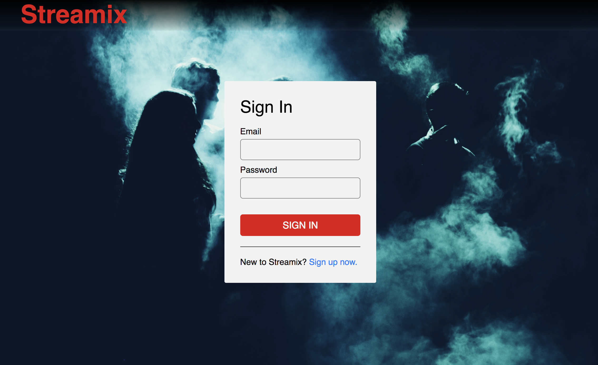
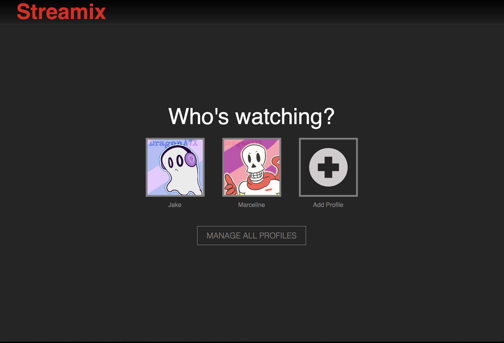
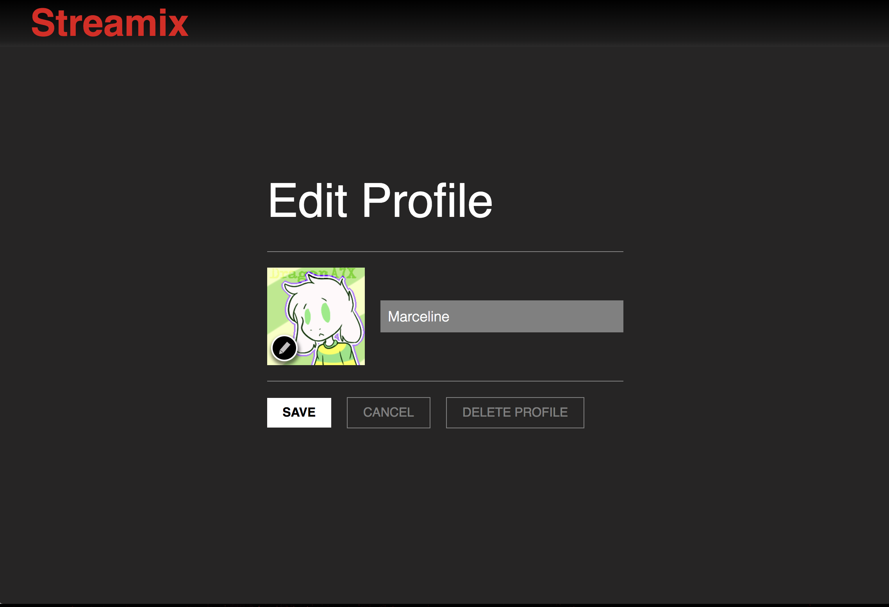
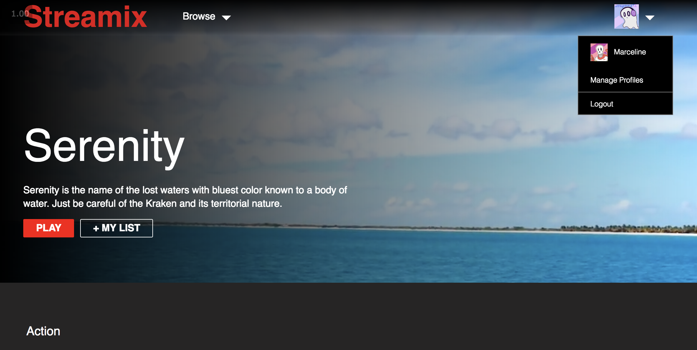
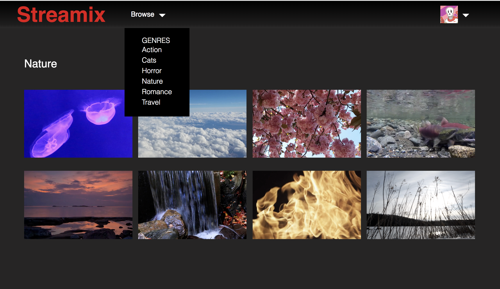

# Streamix

[Live Demo](https://watch-streamix.herokuapp.com)

### Overview
Streamix is a single page application inspired by the popular cross-platform streaming app, Netflix.

### Features
- Sign in/Sign up
- Profile Management
- Library of all Medias
- Browse by Genre
- Modal for Medium Details
- Video Player

### Technical Details

##### Using AWS Elastic Transcoder and Lambda Function
Uses the AWS Elastic Transcoder pipeline to transcode all videos to web-safe formats and to collect thumbnail images from each video. Elastic Transcoder only allows for one video to be transcoded at a time. To automate this process, a trigger event was attached to the S3 bucket where videos would be uploaded to. When the event is triggered, an AWS Lambda function will take the video and trigger the Elastic Transcoder's pipeline to automatically transcode any videos and upload them to the production S3 bucket.

Check out the [AWS Lambda Function](docs/elastic_transcoder_lambda.js).

##### Users can Sign In or Sign Up
Employed the BCrypt ruby gem to hash map and salt all passwords for secure sign in and sign up.

##### Profile Management
Users are given the capability to manage multiple profile accounts. Using a CRUD-based architecture, profiles can be reviewed, created, edited, or deleted.

Users can choose an avatar for each profile.

The form for adding a profile and editing a profile is a reusable component and will switch based on the route the user is on.

##### Reusable Navigation Bar Component
The same navigation bar is used across all pages, but will render something different based on the current path that the user is on.

##### Library of Mediums
Each profile has a library of mediums/videos that are shared amongst all other profiles. By sharing the mediums, this limits the amount of ajax requests made to the backend. Profile users are also allowed to switch profiles through the navigation bar. Each medium is listed under a genre and uses a carousel to navigate through the list of mediums under that genre.

##### Browse by Genre
Using the navigation bar's browse menu, users can browse videos by genre.

